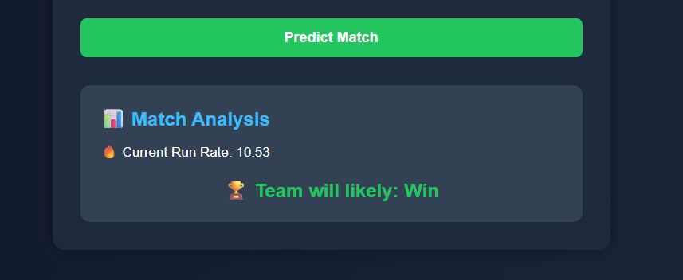

# 🏏 Cricket Match Prediction System

AI-powered Cricket Match Prediction System built using Python, Flask, and the Decision Tree Machine Learning Algorithm. This project predicts cricket match outcomes based on live match statistics such as runs, wickets, overs, innings, target score, and toss results.

---

## 🚀 Features

✅ Predicts match outcomes in real-time  
✅ Supports T20, ODI, and Test matches  
✅ Live match statistics analysis  
✅ Current & Required Run Rate calculations  
✅ Machine Learning prediction using Decision Tree  
✅ Responsive and modern web interface  
✅ Flask-powered backend system  
✅ User-friendly prediction form  

---

## 🛠 Technologies Used

- Python
- Flask
- HTML5
- CSS3
- Pandas
- NumPy
- Scikit-learn
- Decision Tree Classifier
- Machine Learning

---

## 📊 Machine Learning Model

The system uses the **Decision Tree Algorithm** to analyze cricket match data and predict whether a team is likely to:

- 🏆 Win
- ❌ Lose

### Prediction Factors:
- Match Type
- Innings
- Current Runs
- Wickets Lost
- Overs Completed
- Target Score
- Toss Result

---

## 📸 Screenshots

## 📸 Screenshots

### 🏠 Home Page
.png)

### 🤖 Prediction Result

---

## ▶️ How to Run the Project

### 1️⃣ Install Dependencies

```bash
pip install -r requirements.txt
```

### 2️⃣ Run Flask Application

```bash
python app.py
```

### 3️⃣ Open in Browser

```text
http://127.0.0.1:5000
```

---

## 📂 Project Structure

```text
Cricket-Match-Prediction/
│
├── app.py
├── main.py
├── cricket.csv
├── requirements.txt
│
├── templates/
│   └── index.html
│
├── static/
│   └── style.css
│
└── screenshots/
    ├── home.png
    ├── prediction.png
    └── result.png
```

---

## 👨‍💻 Author

**Wahid Ali**  
Computer Science Student | Machine Learning Enthusiast | Full Stack Developer

---

## ⭐ Future Improvements

- Live API cricket data integration
- Advanced ML models
- Team-wise analytics
- Player performance prediction
- Deployment on cloud platforms
- User authentication system

---

## 📜 License

This project is created for educational and learning purposes.
